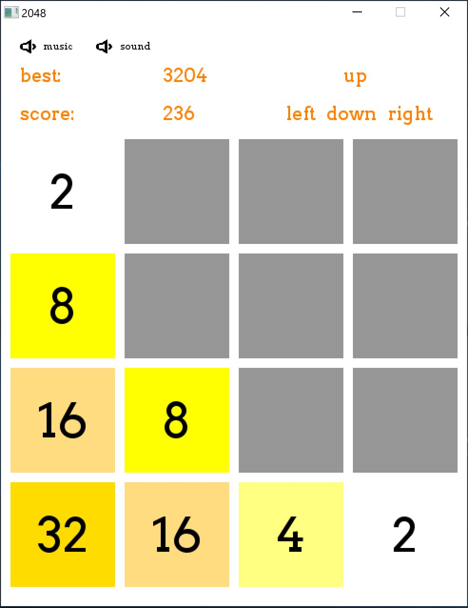

## 2048 Game 
2048 is a single-player sliding block puzzle game designed by Italian web developer Gabriele Cirulli. The game's objective is to slide numbered tiles on a grid to combine them to create a tile with the number 2048. 
However, one can continue to play the game after reaching the goal, creating tiles with larger numbers.

### Preview



## Requirements
1. no requirements if you run the executable directly
2. If you run the game using `2048.py`:
- Python
- Install all the dependencies needed
    ``` 
    pip install -r requirements.txt 
    ```


## Usage:
1. Run  `2048.exe` directly
2.  
    ```
    python 2048.py
    ```

## Running test
If you choose the 2nd way, you will see blow:
```
$ python 2048.py
pygame 1.9.4
Hello from the pygame community. https://www.pygame.org/contribute.html
```

## Note

Since source code for the 1st way is lost, so the 2nd way does not contain music and sound effect. 

## Authors
- **Zhengguan Li**
